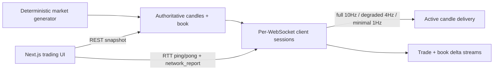

# Real-Time Cryptocurrency Trading Web App

Polished full-stack trading screen for a **simulated** BTC/USD market (`BTC-USD-SIM`). A deterministic Node.js/Express backend generates trades, order-book updates, and OHLCV candles. A Next.js App Router frontend renders the live trading UI, measures connection quality, and receives **per-connection adaptive chart delivery** tiers owned by the backend.

> This is **not** real Bitcoin pricing and does not connect to any exchange.

## Screenshots / screen recording

Add a short screen recording URL here after capture. The recording should show:

1. Live chart updates
2. Interval change (`1m` ↔ `5m`)
3. Order book + recent trades
4. Forced delivery tier change (Full → Minimal → Auto)
5. Recovery after using **Disconnect socket (debug)**

## Architecture

```text
apps/web (Next.js App Router + Zustand + Lightweight Charts)
        │ REST snapshot / candles
        │ WebSocket /ws
        ▼
apps/api (Express + ws)
        │
        ▼
SyntheticTradeGenerator → CandleEngine + OrderBookEngine
        │
        ▼
Per-client delivery scheduler (tier / coalesce candles)
```



Shared contracts live in `packages/protocol` (Zod schemas, constants, message types).

### Why Next.js App Router

App Router is the modern Next.js architecture. The trading experience is a controlled client-side realtime surface (`"use client"`) while still allowing layout/metadata on the server. WebSocket, `window`, visibility, and chart instances stay on the client and are never forced into React Server Components.

### State management

| Layer | Responsibility |
| --- | --- |
| React components | Presentational UI, chart refs, local interaction |
| Zustand (`trading-store`) | Connection status, candles, book top-of-book, trades, tier metrics |
| `MarketSession` | Orchestrates REST + WS + book sync + visibility lifecycle |
| `MarketSocket` | Connect/reconnect, ping/pong, validation, subscriptions |
| `book-synchronizer` | Pure snapshot/delta state machine |

High-frequency candle updates patch the Lightweight Charts series imperatively. Zustand subscriptions are selective so the whole screen does not re-render on every trade.

## Synthetic market generator

- Seeded Mulberry32 PRNG (`MARKET_SEED`, default `42`)
- ~20 generated trades/second (market event rate, **not** chart delivery rate)
- Bounded random-walk mid price around ~\$68,000
- Plausible L2 book (≥20 internal levels, top 10 displayed)
- Deterministic multi-hour history bootstrapped at startup so charts are immediately useful

## Numeric precision

Internal calculations use fixed-point integers:

| Concept | Scale | Example |
| --- | --- | --- |
| Price | `PRICE_SCALE = 100` | \$68,245.17 → `6824517` |
| Quantity | `QUANTITY_SCALE = 1_000_000` | 0.123456 → `123456` |

Wire format uses **decimal strings**. Sequence / trade IDs that can grow without bound are also strings so JSON never loses precision.

## REST API

Base URL default: `http://localhost:4000`

### `GET /health`

```json
{ "status": "ok", "uptimeMs": 12345, "protocolVersion": 1, "marketRunning": true }
```

### `GET /api/v1/market`

Symbol metadata, supported intervals, decimals.

### `GET /api/v1/orderbook?symbol=BTC-USD-SIM`

Snapshot with `sequence`, `bids` (high→low), `asks` (low→high).

### `GET /api/v1/candles?symbol=BTC-USD-SIM&interval=1m&limit=300`

Chronological OHLCV candles. Active candle may be included with `complete: false`.

Errors:

```json
{ "error": { "code": "INVALID_INTERVAL", "message": "Unsupported candle interval" } }
```

## WebSocket protocol

Endpoint: `ws://localhost:4000/ws` (local) / `wss://…` (deployed)

`protocolVersion: 1` on all meaningful messages. Runtime validation via Zod on both sides.

### Client → server

- `subscribe` — symbol, interval, channels (`trades` \| `book` \| `candle`)
- `unsubscribe`
- `ping` — `{ nonce }`
- `network_report` — `{ latencyMs, jitterMs, sampleCount }`
- `tier_override` — `full` \| `degraded` \| `minimal` \| `auto`

### Server → client

- `welcome`, `pong`, `subscription_ack`
- `trade`, `book_delta`, `candle`
- `tier_status`, `error`

## Candle calculation

```text
openTime = floor(timestampMs / intervalMs) * intervalMs
open = first trade price
high = max price
low = min price
close = latest trade price
volume = sum quantities
```

Every generated trade updates authoritative candles **before** any per-client delivery throttling. Final OHLCV is identical across tiers for the same trade stream.

Supported intervals: `1m`, `5m`, `15m` (shared constants in `@crypto/protocol`).

## Order-book synchronization

```text
WS buffer → REST snapshot → discard deltas with seq <= S →
apply contiguous deltas → detect gap → resync
```

Rules:

- `seq < expected` → ignore duplicate/old
- `seq === expected` → apply, expected += 1
- `seq > expected` → gap → resync (never sort gaps to fake continuity)
- Generation tokens ignore stale snapshot responses
- Buffer overflow abandons and restarts sync

## RTT measurement

1. Client stores `sentAt = performance.now()`
2. Sends `ping` with unique `nonce`
3. Server echoes `pong`
4. `RTT = performance.now() - sentAt`

Ping interval ≈ 2 seconds. Pending pings are bounded and expired.

## Latency (EWMA)

```text
latencyEWMA = alpha * currentRTT + (1 - alpha) * previousLatencyEWMA
alpha = 0.2
first sample: latencyEWMA = RTT
```

## Jitter (EWMA of absolute RTT variation)

```text
variation = abs(currentRTT - previousRTT)
jitterEWMA = alpha * variation + (1 - alpha) * previousJitterEWMA
alpha = 0.2
first variation initializes jitterEWMA
```

## Delivery tiers

| Tier | Target max chart rate | Min delivery interval |
| --- | --- | --- |
| Full | 10 Hz | 100 ms |
| Degraded | 4 Hz | 250 ms |
| Minimal | 1 Hz | 1000 ms |

New connections start in **degraded** until enough reports arrive. Tier changes **delivery frequency only**. Trades are never invented to hit target rates. If the active candle did not change, no filler update is sent.

UI shows:

- `Tier target: up to N Hz` (configured maximum)
- `Observed candle delivery: X Hz` (rolling window of received candle messages)

## Hysteresis

Automatic transitions only move `full ↔ degraded ↔ minimal` (adjacent). Debug override may jump anywhere.

| Transition | Condition | Consecutive reports |
| --- | --- | --- |
| Full → Degraded | latency ≥ 180ms OR jitter ≥ 60ms | 3 poor |
| Degraded → Full | latency ≤ 120ms AND jitter ≤ 30ms | 5 healthy |
| Degraded → Minimal | latency ≥ 350ms OR jitter ≥ 120ms | 3 very poor |
| Minimal → Degraded | latency ≤ 250ms AND jitter ≤ 80ms | 5 recovered |

## Missing-report fallback

If reports stop while the socket stays connected:

- after ~10s → ensure tier is no better than **degraded**
- after ~20s → fall back to **minimal**

When reports resume (override off), normal hysteresis recovery applies.

## Debug override

UI control:

```text
Delivery: [Auto] [Full] [Degraded] [Minimal]
```

Override is applied by the **backend** for that WebSocket session. Automatic measurements continue; automatic effective-tier selection is suppressed until `Auto`.

## Disconnect demonstration

Use **Disconnect socket (debug)** in the footer panel. This closes the real browser WebSocket. Cached values remain visible and marked **STALE** while reconnect/backoff restores subscriptions, history refresh, and book snapshot/delta sync.

## Browser lifecycle

On `visibilitychange` → visible:

- refresh selected candle history
- resync order book
- clear stale only after sync + live connection

Hidden tabs avoid unnecessary chart work while keeping critical sync state.

## Stale state

Disconnected / reconnecting / unsynced book → values remain visible but labeled **STALE**. Order book is not marked live until snapshot + contiguous deltas succeed.

## Interval race handling

Candle history fetches use `AbortController` **and** a monotonically increasing request generation. Responses for an old interval never overwrite the currently selected interval.

## Movement definition

Header movement is **percent change vs the open of the first candle in the currently loaded chart window**. Tick coloring uses the previous trade/last price.

## Packages

| Package | Why |
| --- | --- |
| Next.js / React / TypeScript | App Router trading UI |
| Tailwind CSS | Styling |
| Zustand | Selective live UI state |
| lightweight-charts | Render-only candlesticks (no data fetch) |
| Zod | Runtime boundary validation |
| Express + `ws` | REST + WebSocket backend |
| pino | Structured logging |
| Vitest | Unit tests |
| concurrently | Local multi-process dev |

## Local development

```bash
npm install
npm run build -w @crypto/protocol
npm dev
```

Or separately:

```bash
# Backend only (assignment-required explicit command)
npm run dev:api
# equivalent: npm run build -w @crypto/protocol && npm run dev -w @crypto/api

# Frontend only
npm run dev -w @crypto/web
```

Browser connectivity:

```text
Frontend:  http://localhost:3000
Backend:   http://localhost:4000
WebSocket: ws://localhost:4000/ws
Health:    http://localhost:4000/health
```

## Tests

```bash
npm test
```

Important behavioral tests:

- **Tier/hysteresis** (`apps/api/tests/tier-controller.test.ts`) — initial degraded, consecutive demote/promote, override, missing-report fallback
- **Order-book sync** (`apps/web/tests/book-synchronizer.test.ts`) — buffer during snapshot, contiguous apply, gap → resync, duplicates, stale generation
- **Candle invariance** (`apps/api/tests/candle-invariance.test.ts`) — identical OHLCV for the same trades
- **Network EWMA** (`apps/web/tests/network-metrics.test.ts`) — latency/jitter formulas

## Production build

```bash
npm run build
```

## Docker

```bash
docker compose up --build
```

## Deployment

Designed for separate services:

- Frontend: Vercel / any Node host serving Next.js
- Backend: Render / Railway / Fly.io / other **persistent WebSocket-capable** runtime

Configure:

```text
# Frontend
NEXT_PUBLIC_API_BASE_URL=https://api.example.com
NEXT_PUBLIC_WS_URL=wss://api.example.com/ws

# Backend
PORT=4000
HOST=0.0.0.0
CORS_ORIGINS=https://your-frontend.example.com
MARKET_SEED=42
LOG_LEVEL=info
NODE_ENV=production
```

Deployment was **not** performed in this environment (no hosting credentials). No public deployed URL is claimed here.

## Environment variables

See `.env.example`, `apps/api/.env.example`, and `apps/web/.env.example`.

## Known limitations

- Single simulated symbol only (by design)
- In-memory market — restart resets live sequence (history is re-seeded deterministically from `MARKET_SEED`)
- Book model is coherent synthetic L2, not a full matching engine
- Observed candle Hz is a client-side rolling estimate of received candle messages, not a server guarantee
- Production Docker web image expects compose/build args for public API/WS URLs matching the browser-reachable endpoints

## CI

GitHub Actions workflow (`.github/workflows/ci.yml`) runs install, typecheck, lint, test, and build on push/PR.
